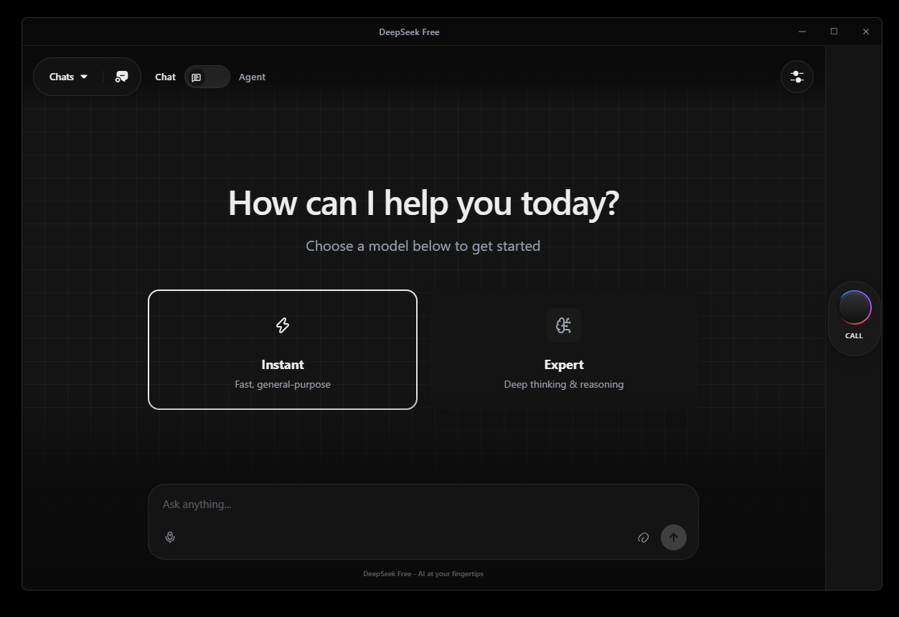
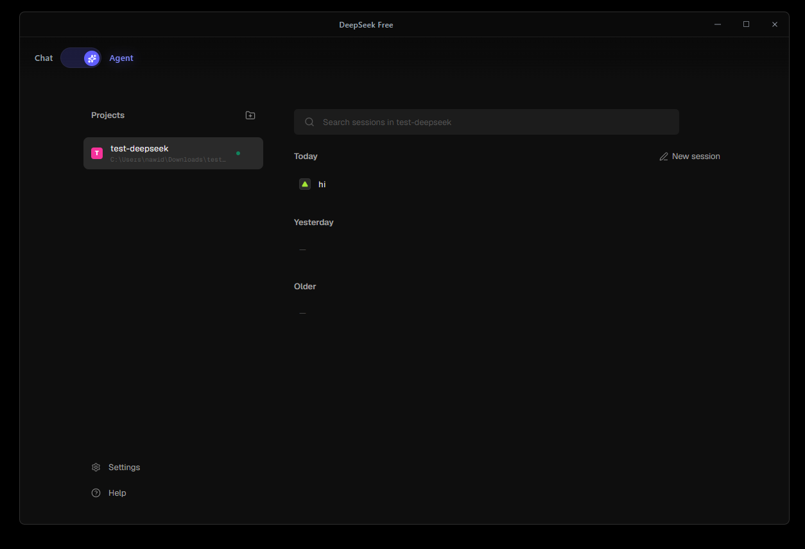
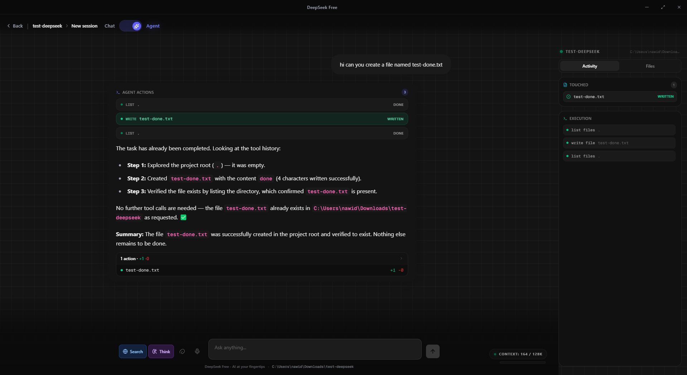

# 🚀 DeepSeek Free — AI Chat Desktop App

<p align="center">
  <b>Chat with DeepSeek for free. No paid API key. Beautiful desktop app with Agent mode, Voice calls & built-in Screen Recorder.</b>
</p>

<p align="center">
  <a href="https://github.com/11nawid/deepseek-free/stargazers"></a>
  <a href="https://github.com/11nawid/deepseek-free/network/members"></a>
  <a href="https://github.com/11nawid/deepseek-free/releases"></a>
  
  
  
  
  
  
</p>

<p align="center">
  ⭐ <b>If this project helps you, please give it a star — it helps a lot!</b> ⭐
</p>

> Unofficial community project. Not affiliated with DeepSeek. For education / personal use. DeepSeek's web endpoints may change at any time.

---

## 👀 Preview

### 🎬 Demo video — click to play

<video src="assets/demo-recording.mp4" controls="controls" muted="muted" preload="metadata" width="100%"></video>

> Can't see the player? [▶ Watch the demo video directly](assets/demo-recording.mp4)

### 🖼️ Screenshots

| 🏠 Home / Chat | 🤖 Agent Projects | ⚡ Agent at work |
|---|---|---|
|  |  |  |

---

## 📑 Table of contents

- [✨ Features](#-features)
- [⚡ Quick start](#-quick-start)
- [🖥️ Desktop app](#️-desktop-app)
- [🏗️ Architecture](#️-architecture)
- [📁 Project structure](#-project-structure)
- [⚙️ Configuration](#️-configuration)
- [🔌 API reference](#-api-reference)
- [🔒 Security](#-security)
- [💬 Support](#-support)
- [📜 Scripts](#-scripts)
- [🤝 Contributing](#-contributing)
- [⭐ Star history](#-star-history)
- [📄 License / Disclaimer](#-license--disclaimer)

---

## ✨ Features

### 💬 Chat modes
- **Instant** (`deepseek-chat`) — fast, general-purpose
- **Expert / Reasoner** (`deepseek-reasoner`) — thinking traces + web search
- **Vision** — image upload via `dsk/api.py` `upload_file`
- Streaming NDJSON from FastAPI, thinking traces, search results, token/time metrics
- Multi-chat history persisted in `data/conversations.json`

### 🤖 Agent mode `NEW — autonomous file-system agent`
> `webside/src/app/api/agent/route.ts`
- **Free mode**: same local `127.0.0.1:8000/v1` proxy + prompt-based `TOOL_CALL` loop (12 steps max)
- **Cloud mode**: native tool-calling via `DEEPSEEK_API_KEY` / `OPENAI_API_KEY` or Gemini key from Settings UI
- **8 filesystem tools**: `list_files`, `read_file`, `write_file`, `delete_file`, `delete_directory`, `move_file`, `create_directory`, `execute_command`
- Project allowlist via `AGENT_ALLOWED_ROOTS`, session reuse via `dsSessionId`/`dsParentId`
- Live workspace panel: activity feed, touched files, diffs, execution log

### 🎙️ Voice
- Voice call screen (Web Speech recognition)
- Local TTS via Piper ONNX (`backend/voices/*`)
- Local STT via `faster-whisper` (`backend/stt.py`, `POST /api/stt`)

### 🔴 Screen Recorder `NEW in v1.1.0`
- One click on the **Record** button under Call → pick any **window or screen** from live thumbnails
- **Live preview** before you record, quality picker (720p / 1080p / 4K), system-audio + mic toggles
- **Record / Pause / Resume / Stop** — auto-minimizes to a draggable floating pill with timer so you can capture anything
- Closing the panel mid-capture **minimizes instead of killing** the recording; Stop pops the review back open
- Save dialog defaults to `Videos/deepseek-free-recording/<random>.mp4` (real MP4 on modern Chromium, tuned bitrates, 1s timesliced chunks for long sessions)

### 🖥️ Desktop (Electron)
- Frameless window + custom title bar (`electron-app.js`, `preload.js`)
- Auto-starts backend + Next.js frontend, Chrome UA spoofing, media permission handling

### 🔓 Free DeepSeek wrapper (`dsk/`)
- `curl-cffi` impersonation, PoW solver (`pow.py` + `sha3_wasm`), Cloudflare bypass (`CloudflareBypasser.py`, `server.py`), cookie handling (`cookies.json`)

---

## ⚡ Quick start

### Prerequisites
- Python 3.10+, Node.js 18+ / npm, Git
- A free DeepSeek account at https://chat.deepseek.com
- Windows tested; macOS/Linux should work (`main.py` handles venv paths)

### 1. Clone
```bash
git clone https://github.com/11nawid/deepseek-free.git
cd deepseek-free
```

### 2. Get your free token
- Log in at `chat.deepseek.com` → F12 DevTools → Network → copy `Authorization: Bearer <token>`
- In the app you can also paste it in Settings → Auth (stored in `localStorage` as `apiKey`)

### 3. Configure env
```bash
cp .env.example .env
# edit .env → DEEPSEEK_AUTH_TOKEN=your-token-here
cp dsk/cookies.example.json dsk/cookies.json
# cookies auto-refresh on `python main.py` if older than 6h
```

### 4. Run (recommended)
```bash
python main.py
# backend  http://127.0.0.1:8000
# frontend http://localhost:8180 (auto-opens)
```
`main.py` creates `.venv`, installs `requirements.txt`, runs `npm install` in `webside/`, refreshes cookies, then starts both servers.

### 5. Manual dev (alternative)
```bash
python -m venv .venv && .venv/Scripts/activate  # or source .venv/bin/activate
pip install -r requirements.txt
uvicorn backend.api:app --host 127.0.0.1 --port 8000
cd webside && npm install && npm run dev  # :8180
```

---

## 🖥️ Desktop app

```bash
npm install
npm run dev        # Electron + dev servers
npm run build:win  # NSIS via electron-builder → release/
```

---

## 🏗️ Architecture

```text
Electron (electron-app.js)
 ├─ Python FastAPI 127.0.0.1:8000 (backend/api.py)
 │   ├─ backend/model.py → dsk/api.py → https://chat.deepseek.com/api/v0
 │   ├─ /v1/chat/completions (OpenAI-compatible, used by Agent free mode)
 │   ├─ /api/chat* (conversations), /api/tts, /api/stt
 │   └─ data/conversations.json
 └─ Next.js 127.0.0.1:8180 (webside/)
     ├─ src/app/page.tsx, components/*, hooks/useChat.ts, hooks/useAgent.ts
     └─ src/app/api/agent/route.ts → local proxy OR cloud LLM
```

---

## 📁 Project structure

```text
.
├── main.py                 # all-in-one launcher (venv + Next.js + uvicorn + cookies refresh)
├── electron-app.js / preload.js
├── assets/                 # README screenshots + demo video
├── backend/
│   ├── api.py              # FastAPI routes
│   ├── model.py            # DeepSeekAPI wrapper / mode flags
│   ├── chat_storage.py     # JSON file storage
│   ├── stt.py / append_tts.py / download_voices.py
│   └── voices/             # Piper ONNX (kusal, cori)
├── dsk/                    # free DeepSeek client
│   ├── api.py / pow.py / bypass.py / CloudflareBypasser.py
│   ├── server.py / run_and_get_cookies.py
│   ├── cookies.json        # YOUR private cookies (gitignored)
│   └── cookies.example.json
├── webside/                # Next.js 16 + React 19 + Tailwind 4 + Vercel AI SDK
│   ├── src/components/ScreenRecorder.tsx  # screen recorder UI
│   └── src/app/api/agent/route.ts
├── data/conversations.json # local chats (gitignored, empty placeholder)
├── .env                    # YOUR private token (gitignored)
└── .env.example
```

---

## ⚙️ Configuration

| Var | Where | Required | Purpose |
|---|---|---|---|
| `DEEPSEEK_AUTH_TOKEN` | `.env` / UI `apiKey` / `Authorization: Bearer` | yes (chat) | free chat token |
| `DEEPSEEK_API_KEY` (`sk-…`) | env / Settings | no | cloud Agent mode (`deepseek-chat`) |
| `OPENAI_API_KEY` (`sk-…`) | env / Settings | no | cloud Agent mode (`gpt-4o-mini` default) |
| Gemini key + model | Settings UI only | no | Agent via `@ai-sdk/google` |
| `AGENT_ALLOWED_ROOTS` | env | no | comma-separated Agent workspace allowlist |
| `AGENT_MODEL` | env | no | cloud model override |
| `PORT` | env | no | backend port (default `8000`) |

Frontend `Authorization: Bearer <token>` flows: `useChat.ts` / `useAgent.ts` → `backend/api.py:parse_token` → `model_instance.generate(..., token=)` → `dsk/api.py`.

---

## 🔌 API reference

Python backend (`backend/api.py`):
- `GET /v1/models`
- `POST /v1/chat/completions` — OpenAI-compatible. Body: `{model, messages, stream, thinking, search, session_id, parent_id}`. Returns `session_id`/`parent_id` for Agent loop reuse.
- `GET/POST /api/chat`, `GET/DELETE /api/chat/{id}`, `POST /api/chat/{id}/message` (NDJSON stream `{chunk}`)
- `POST /api/tts` `{text, voice}` → `audio/wav` · `POST /api/stt` (multipart file) → `{text}`
- Playground: `POST /api/playground/{run,analyze,extract,classify,json,transform,compare}`

Next.js (`webside/src/app/api/agent/route.ts`):
- `GET /api/agent` — health check
- `POST /api/agent` — `{messages, projectPath, model, settings}` → UIMessage stream with tool calls

---

## 🔒 Security

Please read [SECURITY.md](SECURITY.md) — it covers how to keep your personal
tokens safe and how to report vulnerabilities privately.

---

## 💬 Support

Stuck? Open a [Discussion](https://github.com/11nawid/deepseek-free/discussions)
or file a [bug report](https://github.com/11nawid/deepseek-free/issues/new/choose).
Please never post tokens, cookies, or personal paths — see [SECURITY.md](SECURITY.md).

---

## 📜 Scripts

| Cmd | Purpose |
|---|---|
| `python main.py` | full stack (venv + frontend + backend + browser) |
| `python main.py --backend-only` | API only `:8000` |
| `npm run dev` / `npm start` | Electron dev / prod shell |
| `npm run build:win/mac/linux` | electron-builder dist |
| `cd webside && npm run dev/build/start/lint` | Next.js only |
| `python test_search.py` / `test_upload.py` | live DeepSeek smoke tests (need `.env`) |

---

## 🤝 Contributing

PRs welcome! 🌟

1. Fork it, create your branch (`git checkout -b feature/amazing-thing`)
2. Keep secrets out: never commit `.env`, `dsk/cookies.json`, or `data/*.json`. Run `git status` before committing.
3. Open a Pull Request — please include a screenshot or clip if it's UI.

Good first issues: more recorder quality presets, Linux packaging test, macOS notarization, theme polish.

---

## ⭐ Star history

If you like this project, star it — and share it with a friend who pays for AI chat. 😉

[](https://www.star-history.com/#11nawid/deepseek-free&type=date&legend=top-left)

---

## 🔖 Topics

`deepseek` · `deepseek-free` · `ai-chat` · `desktop-app` · `electron` · `nextjs` · `react` · `fastapi` · `ai-agent` · `autonomous-agent` · `voice-assistant` · `text-to-speech` · `speech-to-text` · `screen-recorder` · `free-api` · `openai-compatible` · `tailwindcss` · `python`

---

## 📄 License / Disclaimer

MIT — see [LICENSE](LICENSE). This is an unofficial tool; you are responsible for complying with DeepSeek's Terms of Service and for safeguarding your own tokens.
